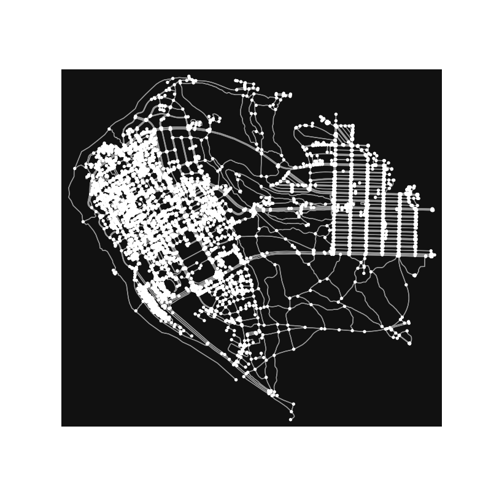
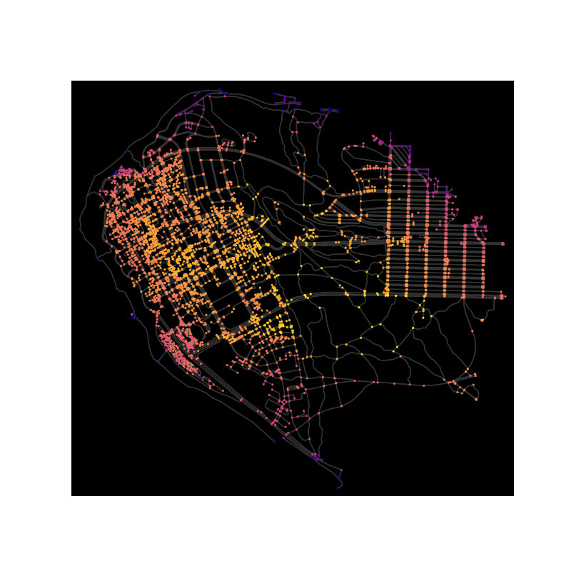
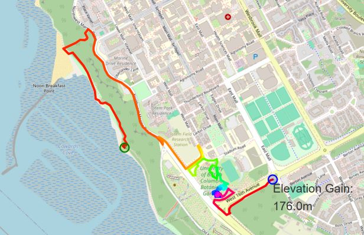
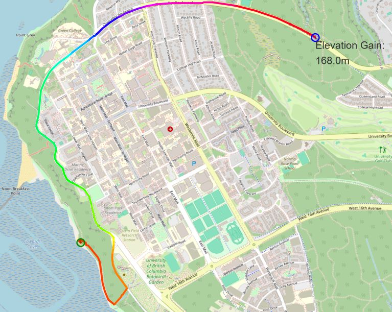

# Project 3

## Intro: Working with Map APIs

Map data is structured (yay!) but usually large scale and highly complex (yikes!), so finding the right representation of a map can help us with designing algorithms that work efficiently. A common approach is to treat street maps as a graph with geolocated points as vertices and streets/paths as edges. We can then utilize graph algorithms to traverse and extract information from a map efficiently.

In this project, we will explore ways to interact with map data, visualize a map, and see basic route planning algorithms in action. Particularly, we want to make a *workout route planner* that plans a *workout route* (for running, biking, dog walking, etc.)  with constraints in length, direction, and elevation gain.

We will obtain map data from [OpenStreetMap](https://www.openstreetmap.org/), an open source service providing maps of the world, through [OSMnx](https://osmnx.readthedocs.io/en/stable/), an open source python framework that provides analysis tools for OSM data. The elevation data are obtained through the [Open-Elevation API](https://www.open-elevation.com/). The project is loosely inspired by various blog articles of [Dr. Geoff Boeing's lab at USC](https://geoffboeing.com/) (I highly recommend any urban planning enthusiast to check them out!) and [this geolocation section of a python cookbook](https://ipython-books.github.io/147-creating-a-route-planner-for-a-road-network/).

## Logistics

### Packages

If you haven't already, make sure you install the packages for working with maps and graphs:

```terminal
conda install osmnx
```

### Getting the Starter Code

**Do not** directly clone the [Project 3 template repository](https://github.com/ubc-cpsc203-2023W2/Project3)!  You have only write access to the template repository so you cannot push your changes to it.  Do not risk losing your work if your laptop crashes: Make your own copy of the repository using the instructions below.

Copy the template repository as a template in to your own GitHub account by following [these instructions](https://docs.github.com/en/repositories/creating-and-managing-repositories/creating-a-repository-from-a-template). Then clone your own copy to your local machine.  Using your own copy you can push and pull as much as you like (and we highly recommend that you push frequently to avoid risk of losing your work if your laptop crashes).

Make sure that your repository is **private** so that you are not unintentionally sharing your code with other students and thereby breaking [the course's academic dishonesty policy](https://ubc-cs.github.io/cpsc203/about/unsyllabus.html#what-is-considered-academic-dishonesty-in-this-course).

### Checking the Starter Code

A "sanity check" in programming is used to refer to a test for which you can quickly check whether the right answer is generated.  Near the beginning of the script `routePlan.py` we generate two plots intended to check whether the map data was correctly loaded:

1. A black and white visualization of the nodes and edges of the graph.
1. A color visualization in which the nodes are shaded according to their elevation.

You can run `routePlan.py` after cloning the repository.  It will eventually fail with an error (the code is not complete), but should first produce those two plots.  Here is what those two plots should look like for the UBC map:

<p float="center">
  
   
</p>

If a plot appears on your screen when you run the script, you may need to close that plot window to continue the script.  The script will also save both plots as `.png` images if you want to examine them later (`ubc_map.png` and `ubc_elevation.png` respectively).

If you get annoyed by having to close plot windows every time you run the script, you can comment out this sanity check code (although you may want to put it back when you are ready to load your own map).

## The Tasks

In `routePlan.py`, we provide a partially completed version (with bugs!) of our workout planner using helper functions from `routeFinding.py`. You will debug and complete our implementation, including the following features:

1. Find any path in the UBC graph whose total distance is between 100% and 110% of a specified target length using depth first search.
1. Add a constraint that we always take the "straightest" direction out of any vertex.
1. Report total elevation gain.
1. Provide a visualization of the route in rainbow color with the calculated elevation gain.

After debugging, your final task is to choose a map at some new location in the world and build a personal workout route in that map.

The images below show the differences between the first and second tasks in the list above. In both cases, the route starts near Wreck beach and proceeds for at least 5000m. In the first task, we let the algorithm determine arbitrarily which direction we should go at every vertex:



In the second task, we constrain the algorithm to choose the outgoing direction at a vertex which is closest to the incoming direction:



### Debugging

There are bugs present in both `routePlan.py` and `routeFindng.py`.  Most of the bugs are small logic errors.  Within the script `routePlan.py`there are:

- 1 existing bug.
- 2 areas to write your own code, marked by `# TODO`.

Within the module `routeFinding.py` there are:

- 5 existing bugs.  Every function has at least one bug, but some functions have more.
- 1 function for you to write, marked by `# TODO`.

You will run the code by running the script `routePlan.py`. This script generates an interactive  route visualization as the file `route_graph_workout.html`. To see if your code is working as intended, open that file in your browser.  Feel free to change the route's starting point or target length if it would help with debugging. We recommend tackling the bugs in order: Make sure that the first feature is working before moving to the second, the second before the third, and so on.

### Generate your own map

To track down the bugs, you have been working with the UBC map in the `graph_ubc.gml` file. Now, it is your turn to generate your own map!

Take a look at the `load_map.py` file. The code in this file is fully functional and includes all the logic needed to generate a new `.gml` file at any location.  All you need to do is choose a new location (look for the `# TODO`) and run the file.  Note that this script may take a few minutes to complete as (a) it will likely download a fair amount of data and (b) the API appears to be flakey so it sometimes takes multiple requests to get what is wanted.

In order to use the new map you will need to modify `routePlan.py` to:

- Load data from the new map file `graph_student.gml`.
- Use a new starting coordinate for your workout route (pick something inside the new map).
- Possibly change what is displayed in the sanity check phase of the script (if anything).

Once you have made these changes, you can rerun `routePlan.py` to generate your own personal workout route.

## Deliverables

- A completed and bug-free `routeFinding.py`.  Make sure you have covered all of the `# TODO` prompts.  PL will autotest your debugged routines using a map of our own.
- An image of your own workout map.  Generate this image by loading the interactive `.html` file into your browser and then taking a screenshot of the map.  (The `.html` file is too large to submit to PL.)  This map will be manually marked.

Note that you **will not** submit your (corrected) version of `routePlan.py` or your `.gml` map file.

## Handing in your work

You will submit two files to the [Project 3 Assessment](https://us.prairielearn.com/pl/course_instance/172874/assessment/2495569) on PrairieLearn:

- `routeFinding.py`
- `project3_screenshot.png`

## Resources

- [OSMnx documentation](https://osmnx.readthedocs.io/en/stable/osmnx.html)
- [NetworkX documentation](https://networkx.org/documentation/stable/reference/index.html)
