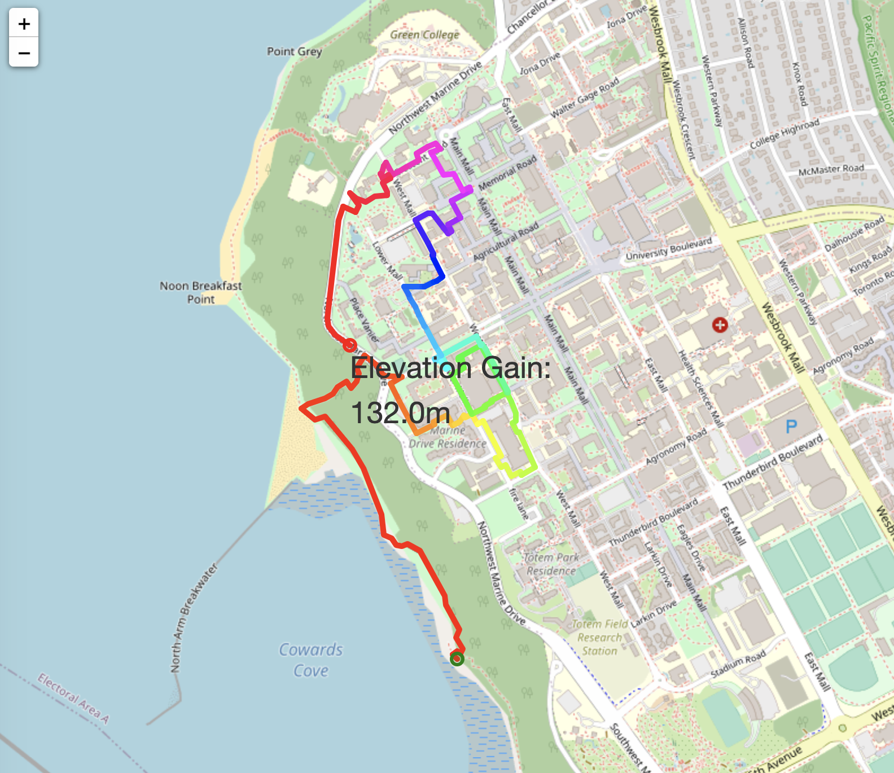
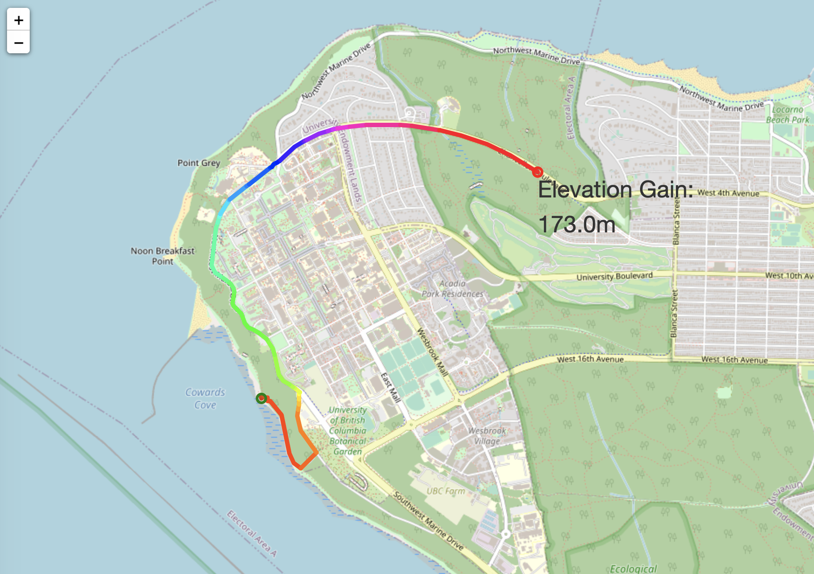
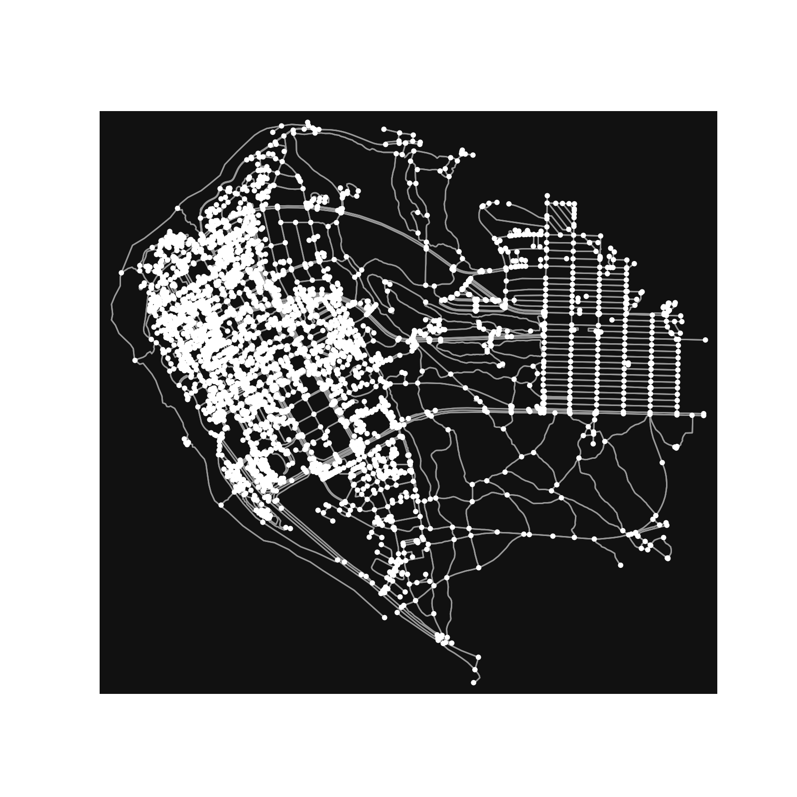
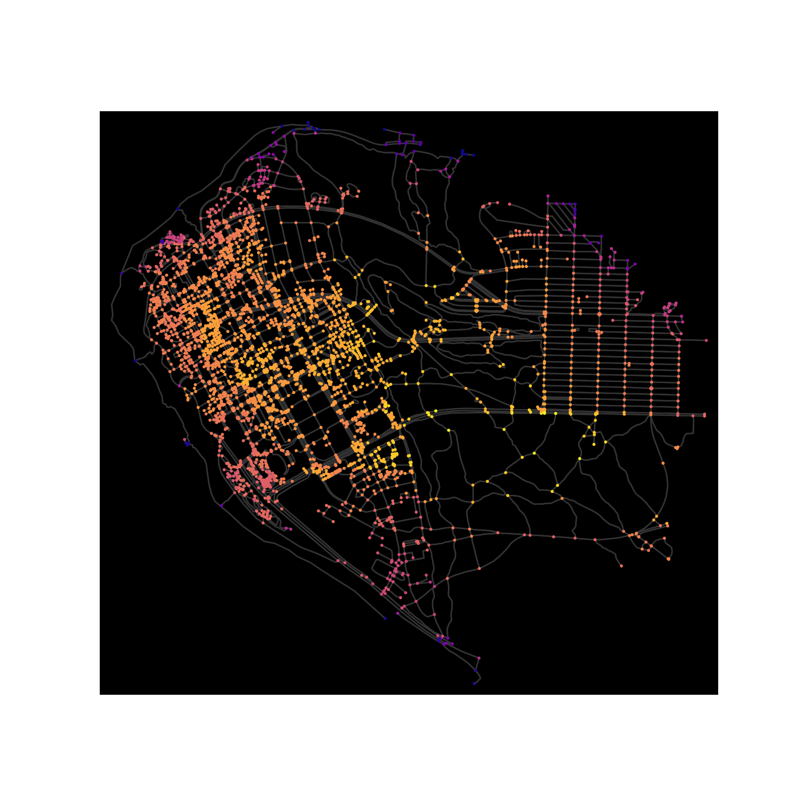

# Intro: Working with Map APIs

Map data is structured yet usually large scale and highly complex, so finding the right representation of a map can help us with designing algorithms that work efficiently. A common approach is to treat street maps as a graph with geolocated points as vertices and streets/paths as edges. We can then utilize graph algorithms to traverse and extract information from a map efficiently.

In this project, we will explore ways to interact with map data, visualize a map and see basic route planning algorithms in action. Particularly, we want to make a "workout route planner" that plans a "workout" (running/biking/dog walking) route with constraints in length, direction, and elevation gain.

We will obtain map data from [OpenStreetMap](https://www.openstreetmap.org/), an open source service providing maps of the world, through [OSMnx](https://geoffboeing.com/2016/11/osmnx-python-street-networks/), an open source python framework that provides analysis tools for OSM data. The elevation data are obtained through the [Open-Elevation API](https://www.open-elevation.com/). The project is loosely inspired by various blog articles of [Dr. Geoff Boeing's lab at USC](https://geoffboeing.com/) (I highly recommend any urban planning enthusiast to check them out!) and [this geolocation section of a python cookbook](https://ipython-books.github.io/147-creating-a-route-planner-for-a-road-network/).

# The Task

In `routePlan.py`, we provided a partially completed version (with bugs!) of our workout planner using helper functions from `routeFinding.py`. You will debug and complete our implementation, including the following features:
- find any path in the UBC graph whose total distance is greater some target length using depth first search
- add constraint that we always take the "straightest" direction out of any vertex
- report total elevation gain
- provide a visualization of the route in rainbow color with the calculated elevation gain

After debugging, your final task is to choose new location for your map! Pick your own area and starting point for your own personal workout planner.

The images below show the differences between the first and second tasks in the list above. In both cases, the route starts near Wreck beach and proceeds for at least 5000m. In the first, we let the algorithm determine arbitrarily which direction we should go at every vertex:

In this example, we have constrained the algorithm to always choose the direction closest to the one we're already going: 

## The bugs
There are bugs present in both `routePlan.py` and `routeFindng.py`. Following is a breakdown of the bugs.

Within `routePlan.py`there are:
- 1 existing bug
- 2 areas to write your own code, maked by # TODO

Within `routeFinding.py` there are:
- 5 existing bug
- 1 function for you to write, marked by a # TODO
- The bugs are distributed so that there is at least one bug in every function, some may have more than one

 Most of the bugs are small logic errors. The script saves an interactive route visualization as `route_graph_workout.html`. Open it from your browser and inspect if it is working as intended. Feel free to change the starting point or target length if it helps with debugging. We recommend tackling the bugs in order: make sure that the first feature is working before moving to the second!

## Generate your own map
So far, we have been working with the `graph_ubc.gml` file. This file was provided to you, which includes the map of UBC. 
Now, it is your turn to generate your own map!

Take a look at the `load_map.py` file. This file includes all the logic needed to generate a .gml file of any location. 
Complete the # TODO by selecting an address of your choosing. Then, run the file.

For our route planner to work with your newly generated .gml file named `graph_student.gml`, modify the code in `routePlan.py`. 
You will need to change both the source gml file AND the starting coordinate of your workout. You may also want to change the map displayed in the sanity check.

Finally, rerun `routePlan.py` to generate your own personal workout plan!

## Running the starter code
1. As sanity checks, there are two visualizations of the map: `ubc_map.png` visualizes the nodes and edges of the map; `ubc_map_elevation.png` colors the nodes based on elevation.

  
   

2. Complete debugging in `routePlan.py` and `routeFinding.py` : implement functionalities, find bugs. Make sure that you have covered all the `TODO` prompts!

3. Run the program by running `routePlan.py`.

3. Generate your own map and workout plan.

4. Submit the `routeFinding.py` file on PrairieLearn to grade your helper functions.

5. Some tips/resources:
	- [OSMnx documentation](https://osmnx.readthedocs.io/en/stable/osmnx.html)
	- [NetworkX documentation](https://networkx.org/documentation/stable/reference/index.html)

# Deliverables

- A completed bug-free `routeFinding.py`
- An image of your own workout map

# Handing in your work

Please submit the file above to PrairieLearn.

# Good Luck!

